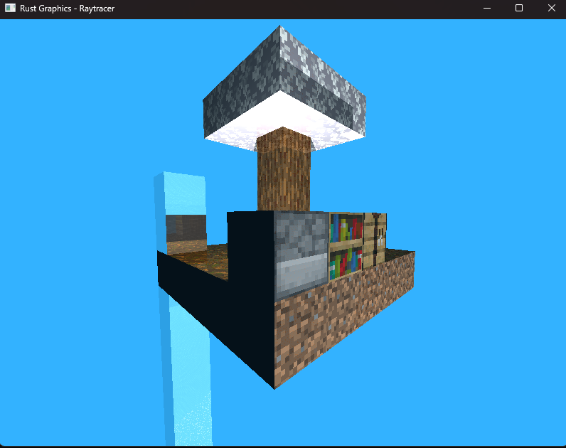

# Poyecto2-GraficasXComputadoras

Proyecto 2 de la clase Graficas por coputadoras

```
git clone https://github.com/BrandonReyes0609/Poyecto2-GraficasXComputadoras.git

```

Accede a la carpeta del repositorio

```
cd Poyecto2-GraficasXComputadoras

```

**Ejecutar el programa**

`cargo build --release`

`./target/release/codigo`

**Uso de camara**

* acercar camara: grio scroll de mouse hacia adelante
* alejar camara: grio scroll de mouse hacia atras
* girar camara hacia derecha: precionar click izquierdo y mover mouse derecha a izquierda
* girar camara hacia izquierda: precionar click izquierdo y mover mouse izquierda a derecha
* mover arriba: precionar click izquierdo y mover mouse de adelate hacia atras ó arriba a abajo
* mover camara abajo: precionar click izquierdo y mover mouse de atras hacia adelante ó bajo hacia arriba

**Componentes del mundo**

Se agrego al mundo texutas de:

* Tierra
* Madera
* Panal de abajeas
* Agua refectiva
* Hojas de arbol
* Horno que genera su propia luz
* Mesa de crafteo
* Librera
* Sol que gira alrrededor del mundo
* etc...

**Video**: 

[https://youtu.be/c8Poo95rJjM](https://youtu.be/c8Poo95rJjM "https://youtu.be/c8Poo95rJjM")

|
